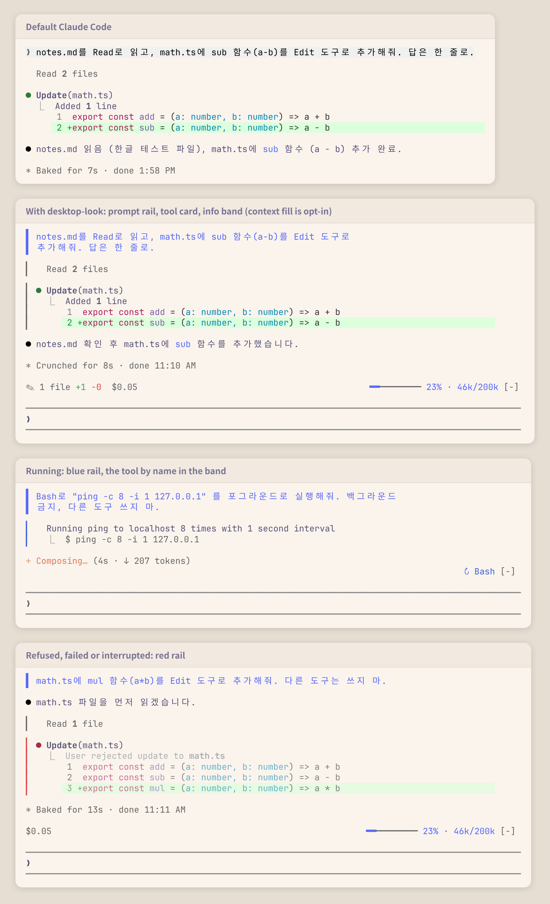

# desktop-look

A Claude Code mod that makes the terminal transcript look more like the desktop app.



- **Prompt rail**: your own messages carry a blue rail down their left edge and blue text, on the reply's own left edge so a wide screen never carries them out of sight; one row tall for a one-line prompt, wrapping at a share of the terminal width
- **Tool cards**: a tool call, its live progress and its result share one rail down the left edge, so they read as one card
- **State at a glance**: the rail is blue while a call runs, red when it errored, was refused at the dialog or was interrupted, and dim once done
- The engine still draws everything inside a card, so each tool's own summary and diff are unchanged
- **Info band** above the prompt: what this session edited (`✎ 2 files +7 -0`) and spent (`$0.05`) on the left, the tools running (`↻ Read ×3, Grep`, or `↻ 4 running` when narrow) on the right; hidden when there is nothing to show
- Assistant replies are left alone, so it works alongside [smooth-stream](../smooth-stream)
- Terminal only; the desktop app, VS Code and mobile keep their own look

## Install

```sh
claude plugin marketplace add KyongSik-Yoon/claude-mods
claude plugin install desktop-look@kyongsik-mods
```

Then run `/reload-plugins` or start a new session. Requires a Claude Code build with mods support (tested on 2.1.289, fullscreen and light/dark themes).

## Options

No setup needed. To change one, run `/plugin configure desktop-look@kyongsik-mods` (or open `/config`):

| Option | Default | |
| --- | --- | --- |
| Bubble width | `75%` | How wide your own messages may grow: `60%`, `75%` or `90%` of the terminal |
| Info band | on | The band above the prompt |
| Band: model | off | Model and effort, for a status line that does not show them |
| Band: context | off | Context fill, for a status line that does not show it: blue while calm, yellow from 300k tokens or 70%, red from 500k tokens or 90%, whichever comes first |

The cost is what Claude Code computes at API prices; on a subscription it is not what you are billed.

## How it works

- `UserMessage` (your own prompts only, not task notifications or other sessions' messages) is drawn as its text in the theme's `suggestion` blue beside an absolutely positioned one-column rail that stretches to the text's height.
- `ToolUse`, `ToolGroup`, `ToolProgress` and `ToolResult` are separate render sites, so one border cannot span them. Each wraps the engine's own row (`await next(e)`) and adds an absolutely positioned one-column rail that stretches to the row's height, skipping the blank line the engine opens a tool row with.
- The rail colour comes from the row's props: `isRunning`, `isErrored`, `isInterrupted`, and the calls of a group.
- The band is an `AbovePrompt` hook reading values in `$.state`, written by `tool.call` (tools running, and the `+`/`-` lines of each Edit and Write result's patch), `session.measure` (cost, context) and `turn.step` (model). A new session (`/clear`) starts the tally over; a reload keeps it.

## Develop

```sh
claude plugin validate .
claude plugin test .
```
